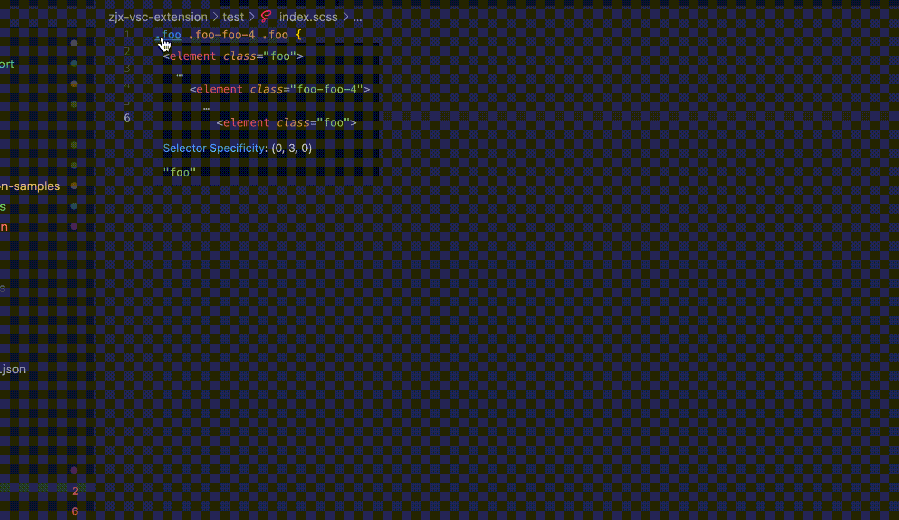

# psfe-react-extension

a vscode extension for react developer

## changelogs

### 0.0.3

**completion & goto defination**

### 0.0.4

**incremental text sync & store & parse**

### 0.0.5

**Better use under the directory dimension**

- [fix: issue 4](https://github.com/1360151219/react-class-completion/issues/4)

## Get Started

search for 'psfe-react-extension' in VScode Extensions and install it.

## features

💡[Tips] The following functions are parsed and supported **in the directory dimension**.

For instance，in this following structure，we can get the class completions which are parsed from the tsx files in the same dir path in the all scss files

```
|--index1.tsx
|--index2.tsx
|--    ...tsx
|--index1.scss
|--index2.scss
```



- [x] 🌟 **support incremental text sync and store & incremental parse algorithm**
- [x] 🌟 **support class name completions for `scss/css` from `.tsx` files below the same dir path**.
  - [x] ordinary className in JSXAttribute.
  - [x] variable className in JSXAttribute. example：
  ```ts
  // src/index,tsx
  const prefix = 'foo';
  export const foo = () => (
    <div>
      <div className="foo">foo</div>
      <div className="foo2">foo</div>
      <div className={`${prefix}3`}>foo</div>
      <div className={`${prefix}-${prefix}-4`}>foo</div>
    </div>
  );
  ```
  - [x] listening for classname changing in `.tsx` file.(only in changed file)
- [x] 🌟 **support go to defination from classname in `scss/css` to the relative `tsx` file**
  - [] scss variable support

## Q&A

1. Why text incremental sync is invalid?

you must config like this when server initialization

```js
  change: TextDocumentSyncKind.Incremental,
  openClose: true, // make the connect.onDidContentTextDocument event sent to the lsp
  save: true,
```
