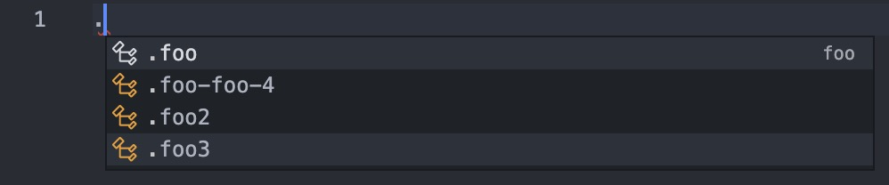

# react-class-completion

a vscode extension for react developer

## features

- [x] **support class name completions for `scss/css` from `.tsx` files below the same dir path**.
  - [x] ordinary className in JSXAttribute.
  - [x] variable className in JSXAttribute. example：
  ```ts
  // src/index,tsx
  const prefix = 'foo';
  export const foo = () => (
    <div>
      <div className="foo">foo</div>
      <div className="foo2">foo</div>
      <div className={`${prefix}3`}>foo</div>
      <div className={`${prefix}-${prefix}-4`}>foo</div>
    </div>
  );
  ```
  
  - [] listening for classname changing in `.tsx` file.
